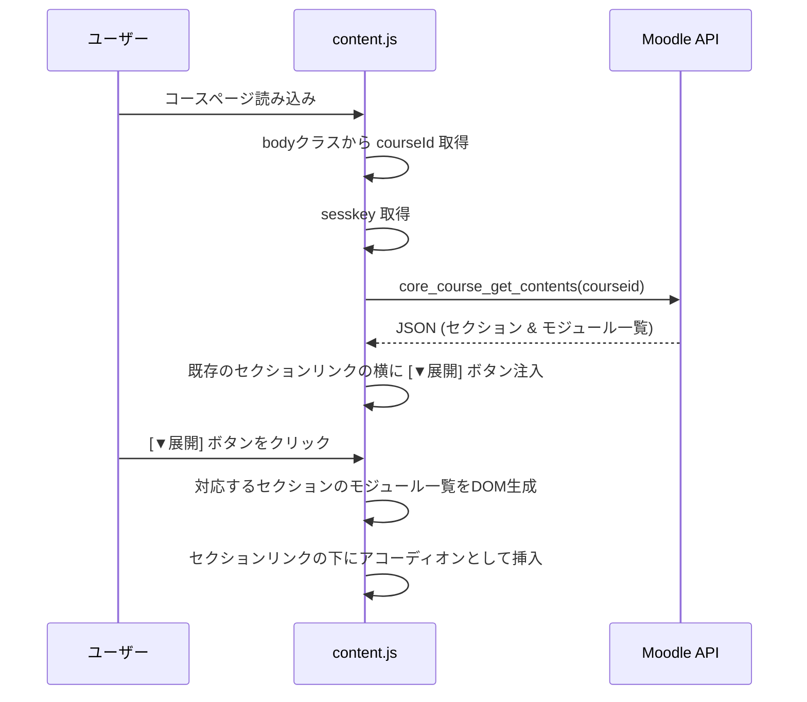
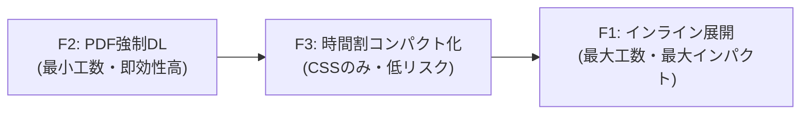

# Phase 2: Moodle UX改善 — 要件定義・詳細設計

## 1. 概要

立命館大学 Moodle (`lms.ritsumei.ac.jp`) のUXを Chrome拡張機能から大幅に改善する。Phase 1（ダウンロードファイルの自動フォルダ分け）に続き、Phase 2ではMoodle APIとDOM操作を組み合わせた3つの機能を実装する。

---

## 2. 機能一覧と優先度

| 機能ID | 機能名 | 概要 | 優先度 |
|--------|--------|------|--------|
| F1 | コースコンテンツのインライン展開 | Week→資料→PDFと深くクリックする必要をなくす | ★★★ 最高 |
| F2 | PDF強制ダウンロード化 | ブラウザでPDFが開かれる問題を解決し、直接DLさせる | ★★★ 最高 |
| F3 | 時間割のコンパクト表示 | ダッシュボードの時間割が大きすぎてスクロールが必要な問題を解決 | ★★☆ 高 |

---

## 3. F1: コースコンテンツのインライン展開

### 3.1. 現状の問題

コースページ (`/course/view.php?id=XXXXX`) では、各週（Week1, Week2...）がセクションとして表示されるが、各セクションをクリックすると **別のページ** (`/course/section.php?id=YYYYY`) に遷移する。さらにその中の資料をクリックするとまた別のページ (`/mod/resource/view.php?id=ZZZZZ`) に遷移し、そこでようやくPDFへのリンクが表示される。

```
ダッシュボード → コースページ → section.php（Week1）→ resource/view.php → PDF
            4クリック必要
```

### 3.2. 理想の状態

コースページ上で各Weekのボタンを押すと、**ページ遷移なしに** そのWeekに含まれるすべてのアクティビティ（資料、課題、小テストなど）が同一ページ内にアコーディオン形式で展開される。

```
コースページ上で [▼ Week1] を展開 → 資料リスト即表示 → ワンクリックDL
            1クリック + 1クリックDL = 2クリックで完了
```

### 3.3. 技術設計

#### 使用するAPI
*   **`core_course_get_contents`**
    *   引数: `courseid` (コースID)
    *   戻り値: セクション配列。各セクションには `modules[]` があり、各モジュールに `name`, `modname`, `modicon`, `url`, `contents[]` (ファイルリソースの場合にDL用URL含む) が含まれる。

#### 処理フロー


#### DOM操作の対象セレクタ
*   **コースページのセクション一覧**: `.course-content` 内の各セクション要素
*   **各アクティビティ**: `li.activity` (クラスに `modtype_resource`, `modtype_folder`, `modtype_assign` 等)
*   **リソースリンク**: `a.aalink.stretched-link` (メインのクリック可能リンク)

#### 展開時に表示する情報と階層構造（フォルダ対応）
ただフラットに並べるだけでは、「授業資料」と「補足資料」のフォルダの違いが分からなくなるため、以下のように階層構造とカード型のUIデザインを維持して展開します。

*   **UIデザイン**: 展開されたリストは、Moodleの本来のデザインから浮かないようにしつつ、視認性の高いカード型（背景の微小な色分けと丸みを帯びた枠線）で描画します。
*   **フォルダ階層の維持**: 取得したAPIデータ（`module.modname === 'folder'`）の中にさらにファイルがある場合、**インデントを下げる・左側に縦線を引く**などをして、「この資料は『補足資料』フォルダの中身である」ことが視覚的に瞬時に分かるツリー構造のUIを採用します。

| 表示項目 (リストの1行) | ソース |
|----------|--------|
| アイコン | `module.modicon` |
| 資料名・フォルダ名 | `module.name` |
| 種別タグ | `module.modname` ("resource"→📄, "assign"→📝, "folder"→📁 等) |
| ダウンロードリンク (PDFの場合) | `module.contents[0].fileurl` + ファイルチェック |

#### 実装ファイル
*   `src/content/course-expander.js` [NEW] — メインのUI構成ロジック
*   `src/lib/moodle-api.js` [NEW] — API呼び出し共通モジュール
*   `src/content/style.css` [NEW] — アコーディオンUI用CSS

---

## 4. F2: PDF強制ダウンロード化

### 4.1. 現状の問題

Moodleのファイルリソース (`mod/resource/view.php`) をクリックすると、デフォルトでブラウザの内蔵PDFビューアでファイルが **表示** される。ユーザーはローカルにコースごとに資料を保存・管理したいため、毎回手動で「ダウンロード」ボタンを押す手間が発生している。

#### 現在のリンク構造 (DOM調査結果)
リソースページ (`mod/resource/view.php`) 内に、以下のクラスを持つリンクが存在する:
```html
<div class="resourceworkaround">
  <a href="https://lms.ritsumei.ac.jp/pluginfile.php/{contextId}/mod_resource/content/{version}/{filename}">
    ファイル名
  </a>
</div>
```

### 4.2. 理想の状態

**方法A（コースページ上で解決 - F1との連携）**: F1のインライン展開を使えば、リソースページ自体を訪問する必要がなくなる。展開されたリスト内のダウンロードリンクに `?forcedownload=1` が付与されているため、クリック即ダウンロードとなる。

**方法B（リソースページでの自動DL）**: `mod/resource/view.php` に遷移してしまった場合でも、content script が `pluginfile.php` のURLを検出し、`?forcedownload=1` を付与した上で自動的にそちらへリダイレクトする（もしくは `chrome.downloads.download()` を呼ぶ）。

### 4.3. 技術設計

#### 方法A: F1展開リスト内での強制DL（推奨・メイン）
`core_course_get_contents` APIが返す `contents[].fileurl` にはすでに `pluginfile.php` 形式のURLが含まれている。
ここで**「拡張子が `.pdf` の場合のみ」** `?forcedownload=1` を付与し、動画（`.mp4`等）やその他ファイルの場合はブラウザ内表示を維持する。

```javascript
// fileurl例: https://lms.ritsumei.ac.jp/webservice/pluginfile.php/.../file.pdf
const downloadUrl = module.contents[0].fileurl;

// PDFファイルのみ強制ダウンロード化
let finalUrl = downloadUrl;
if (downloadUrl.toLowerCase().includes('.pdf')) {
    finalUrl = downloadUrl.includes('?') 
        ? downloadUrl + '&forcedownload=1' 
        : downloadUrl + '?forcedownload=1';
}
```

#### 方法B: リソースページでの自動リダイレクト
```javascript
// 対象ページ: /mod/resource/view.php
// DOM要素: .resourceworkaround a
const resourceLink = document.querySelector('.resourceworkaround a');
if (resourceLink && resourceLink.href.includes('pluginfile.php')) {
    // 拡張子またはファイル名をチェックし、PDFのみをリダイレクトさせる
    if (resourceLink.href.toLowerCase().includes('.pdf') || resourceLink.textContent.toLowerCase().includes('.pdf')) {
        const url = new URL(resourceLink.href);
        url.searchParams.set('forcedownload', '1');
        window.location.replace(url.toString());
    }
}
```

#### manifest.json の変更
```jsonc
"content_scripts": [
    {
        "matches": [
            "https://lms.ritsumei.ac.jp/course/view.php*",
            "https://lms.ritsumei.ac.jp/course/section.php*",
            "https://lms.ritsumei.ac.jp/mod/*"
        ],
        "js": [
            "src/content/content.js",
            "src/content/course-expander.js",  // F1用（コースページのみで動作）
            "src/content/force-download.js"    // F2用（resource/view.phpのみで動作）
        ]
    }
]
```

#### ユーザー設定（将来）
PDF強制ダウンロードは全ユーザーが望むわけではないため、将来的には拡張機能のオプションページ ( `options.html` ) でON/OFF切り替えを提供する。

#### 実装ファイル
*   `src/content/force-download.js` [NEW] — リソースページでの自動DLリダイレクト

---

## 5. F3: 時間割のコンパクト表示

### 5.1. 現状の問題

ダッシュボード (`/my/`) 下部の「My時間割表」は、各コマ（セル）のサイズが非常に大きく、1画面内に全コマが収まらない。スクロールしないと3限以降が見えない。

#### DOM構造（調査結果）
```
div.timetable-table ─── table.timetable
    └── tr
        ├── td.time        (時限のヘッダセル: "1", "2", ...)
        ├── td.empty       (空きコマ)
        └── td.highlight   (授業があるコマ)
```
*   テーブルが `<table>` 要素で構成されており、各行 `<tr>` が1つのコマ（時限）に対応。
*   `td.highlight` は科目名・教室名・アイコンを含むため、テキスト量に応じてセルが縦方向に膨張。
*   3限の行は最大 **580px** 以上にまで膨張する場合がある。

### 5.2. 理想の状態

時間割全体がスクロールなしで画面内に収まる。各コマのセルサイズを均等でコンパクトにし、科目名と教室名の最低限の情報が一覧できる。

### 5.3. 技術設計

#### CSSオーバーライドによる解決

**Content Script から注入するCSS** で、テーブルの行高さを強制的に制限する。

```css
/* 時間割テーブル全体の幅を制限 */
.timetable-table {
    max-height: 500px !important;    /* ビューポートに収まる高さ */
    overflow: visible !important;
}

/* テーブルレイアウトを固定化 */
table.timetable {
    table-layout: fixed !important;
    width: 100% !important;
}

/* 各セルの高さを均一に制限しつつ、クリック判定を維持 */
table.timetable td, table.timetable th {
    height: 60px !important;
    max-height: 60px !important;
    padding: 2px !important;
    overflow: hidden !important;
    text-overflow: ellipsis !important;
    vertical-align: top !important;
}

/* 授業のセル（ハイライト部）の中身とリンク保護 */
table.timetable td.highlight {
    position: relative;
}

table.timetable td.highlight a {
    display: block;
    height: 100%;
    width: 100%;
    font-size: 0.75rem !important;
    line-height: 1.1 !important;
    text-decoration: none !important;
}

/* 時限のヘッダセル */
table.timetable td.time {
    width: 30px !important;
    text-align: center !important;
}

/* ホバー時にツールチップで全文表示＆クリック領域の最前面化 */
table.timetable td.highlight:hover {
    overflow: visible !important;
    z-index: 10;
}
table.timetable td.highlight:hover > div {
    /* 展開されるツールチップ風のコンテナ */
    background: inherit;
    position: absolute;
    top: 0; left: 0; right: 0;
    min-height: 100%;
    padding: 6px;
    box-shadow: 0 4px 8px rgba(0,0,0,0.1);
    border-radius: 4px;
}
```

#### hover時の拡大ツールチップとクリック保護
時間割のセル（`.highlight`）は、授業ページへ飛ぶ重要なリンク（`<a>` レイヤ）を含んでいます。`overflow: hidden` で見た目を切り詰める際、`pointer-events` の崩れや z-index の干渉によって**「クリックして授業ページに飛べない」という致命的バグが発生しないよう**に、アンカータグ `<a>` 自体をブロック化してセルの全面を覆う設計にします。
また、ホバー時に省略された文字が見えるようにする際は、親要素を広げるのではなく、内部の `<div>` を絶対配置(`position: absolute`)で浮き上がらせて元のリンククリックを妨害しない実装とします。

#### 実装ファイル
*   `src/content/timetable-compact.css` [NEW] — 時間割コンパクト化CSS
*   `src/content/timetable-compact.js` [NEW] — ツールチップ等のJS強化（必要な場合）

#### manifest.json の変更
```jsonc
"content_scripts": [
    {
        // ダッシュボード専用 (時間割はダッシュボードにのみ存在)
        "matches": ["https://lms.ritsumei.ac.jp/my/*"],
        "css": ["src/content/timetable-compact.css"]
    }
]
```

---

## 6. ファイル構成まとめ（Phase 2 完成後）

```
src/
├── background/
│   └── background.js             (既存: DLフォルダ分け)
├── content/
│   ├── content.js                (既存: コース名保存)
│   ├── course-expander.js        [NEW] F1: インライン展開UI
│   ├── force-download.js         [NEW] F2: PDF強制DL
│   ├── timetable-compact.js      [NEW] F3: 時間割のJS強化
│   ├── timetable-compact.css     [NEW] F3: 時間割コンパクトCSS
│   └── style.css                 [NEW] F1: アコーディオン展開UI用CSS
├── lib/
│   └── moodle-api.js             [NEW] 共通: API呼び出し抽象化
└── assets/
    ├── icon48.png
    └── icon128.png
```

---

## 7. manifest.json の更新見積もり

```jsonc
{
    "manifest_version": 3,
    "name": "Moodle Enhancer for Ritsumeikan",
    "version": "2.0.0",
    "permissions": ["storage", "downloads", "scripting"],
    "host_permissions": ["https://lms.ritsumei.ac.jp/*"],
    "background": {
        "service_worker": "src/background/background.js"
    },
    "content_scripts": [
        {
            "matches": [
                "https://lms.ritsumei.ac.jp/course/view.php*",
                "https://lms.ritsumei.ac.jp/course/section.php*",
                "https://lms.ritsumei.ac.jp/mod/*"
            ],
            "js": [
                "src/lib/moodle-api.js",
                "src/content/content.js",
                "src/content/course-expander.js",
                "src/content/force-download.js"
            ],
            "css": ["src/content/style.css"]
        },
        {
            "matches": ["https://lms.ritsumei.ac.jp/my/*"],
            "js": [
                "src/lib/moodle-api.js",
                "src/content/content.js",
                "src/content/timetable-compact.js"
            ],
            "css": ["src/content/timetable-compact.css"]
        }
    ],
    "icons": {
        "48": "src/assets/icon48.png",
        "128": "src/assets/icon128.png"
    }
}
```

---

## 8. 実装順序の提案



1.  **F2 (PDF強制DL)** — 実装量が最も少なく(1ファイル, 〜20行)、即座に体感できる改善。
2.  **F3 (時間割コンパクト化)** — CSS中心の実装で低リスク。ダッシュボードの使い勝手が劇的に向上。
3.  **F1 (インライン展開)** — APIの活用、DOM生成、CSS設計が絡む最も複雑な機能。ただし最大のインパクトあり。

---

## 9. テスト計画

| 機能 | テスト方法 | 確認ポイント |
|------|-----------|-------------|
| F1 | コースページのWeekボタン展開 | 全モジュールが表示されるか、DLリンクが正しいか |
| F2 | `mod/resource/view.php` に遷移 | PDFが自動DLされるか、DL先フォルダは正しいか (Phase1との連携) |
| F3 | ダッシュボード `/my/` を開く | 全コマがスクロール不要で表示されるか、ホバーで全文見えるか |

---

## 10. 既知のリスクと対策

| リスク | 対策 |
|--------|------|
| `core_course_get_contents` の `fileurl` がトークン認証方式で返る可能性 | Content Script内からの呼び出しではCookieベースの認証が適用されるため、`pluginfile.php` URLをそのまま使える見込み。動作しない場合は、レスポンスの `fileurl` を通常の `pluginfile.php` パスに変換する処理を追加 |
| F2の自動リダイレクトがPDF以外のリソース（動画等）にも発動 | `content-type` チェック、または `.pdf` 拡張子チェックで制御。設定画面(options)でON/OFF可能にし、全ファイルDL or PDFのみ を選択可能にする |
| F3のCSSオーバーライドがMoodleの他のUIを破壊 | セレクタのスコープを `.timetable-table table.timetable` に厳密に限定し、他のテーブルに影響しないようにする |
| F1でAPI取得に失敗した場合 | フォールバックとして既存のセクションリンク（別ページ遷移）をそのまま残す。展開ボタンのみ非表示にする |
