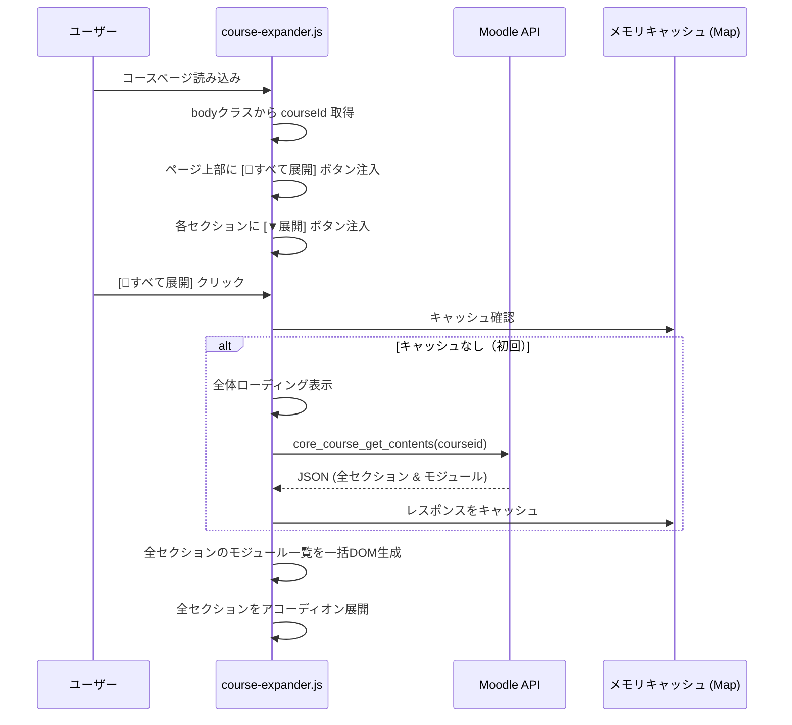

# Phase 2: Moodle UX改善 — 要件定義・詳細設計 v3

> **v3 変更点**: 3回のレビュー（アーキテクチャ / Moodle専門家 / 鬼PM）の全指摘を統合。
> ユーザーの声を起点に設計を再構成。F2 をゼロクリック方式に変更。F1 に「すべて展開」追加。
> options ページ・UIデザイン方針を追加。

---

## 1. ユーザーの声（設計の原点）

この拡張機能は、以下のユーザーの不満を解決するために存在する。
すべての設計判断はこの声に立ち返る。

> 「**誰でも使えるような忌避感、嫌悪感のないUI**は大事。」

> 「使ってて不便だと感じているのは、資料を取りに行くときに**深いサブディレクトリ的なとこまでクリックしていかないといけない**こと。」
> 「ダッシュボード→授業→Week1→授業資料→ここでやっと資料発見」

> 「PDFをクリックしたらインストールされるんじゃなくて**Web上でPDFが開かれています**。毎回インストールしているので不便です。」

> 「ダッシュボードに表示されている時間割が無駄に**１コマあたりのサイズがでかくてスワイプしないと全部見えない**のが不便です。**固定ですべて見えるようにしたい**。」

---

## 2. 機能と実装順序

### ユーザーインパクト順に並べ替え

| 順序 | 機能ID | 機能名 | ユーザーの不満 | インパクト |
|------|--------|--------|-------------|-----------|
| 1 | F2 | PDF自動ダウンロード | 「PDFが毎回ブラウザで開かれる」 | ★★★ (即効性最大・工数最小) |
| 2 | F3 | 時間割コンパクト化 | 「スワイプしないと全部見えない」 | ★★☆ (CSS中心・中工数) |
| 3 | F1 | コースコンテンツの全展開 | 「4クリック必要」 | ★★★ (最大改善・最大工数) |

> F2 は F1 に内包される機能だが、F1 の実装完了まで何もリリースしないのは悪手。
> F2 を「F1 完成までの即効薬」として先にリリースし、F1 完成後は F2 を「保険」として残す。

### バージョン計画

| バージョン | 内容 | リリース物 |
|-----------|------|-----------|
| v1.1.0 | F2 + options ページ最小版 | force-download.js, options.html |
| v1.2.0 | F3 | timetable-compact.css/js |
| v1.3.0 | F1 (F2 のロジックを統合) | course-expander.js/css |

---

## 3. F2: PDF自動ダウンロード

### 3.1. ユーザーの不満

> 「PDFをクリックしたらインストールされるんじゃなくてWeb上でPDFが開かれています。毎回インストールしているので不便です。」

### 3.2. 理想の状態

ユーザーが `mod/resource/view.php` に遷移したら、**何も操作せずに** PDFのダウンロードが開始される。

### 3.3. 技術設計

#### 方針: `chrome.downloads.download()` API によるゼロクリック自動DL

> [!IMPORTANT]
> v2 の「リンク書き換え方式」はユーザーに2度目のクリックを要求するためユーザー体験が劣る。
> v3 では `chrome.runtime.sendMessage` → background.js の `chrome.downloads.download()` を使い、
> **ページ遷移と同時にダウンロードを開始する**。
> コースIDをメッセージに含めるため、referrer 問題が根本的に解消される。

```javascript
// force-download.js — /mod/resource/view.php 専用
// run_at: "document_end"

(function() {
    // =================================================================
    // 1. PDFファイルの URL を検出
    // =================================================================

    // Moodle の「表示」設定によって DOM 構造が異なる
    let pluginfileUrl = null;

    // パターン1: resourceworkaround（デフォルト表示の場合）
    const workaroundLink = document.querySelector('.resourceworkaround a[href*="pluginfile.php"]');
    if (workaroundLink) {
        pluginfileUrl = workaroundLink.href;
    }

    // パターン2: 埋め込み表示の場合（iframe / object / embed）
    if (!pluginfileUrl) {
        const embedded = document.querySelector(
            '.resourcecontent object[data*="pluginfile.php"],' +
            '.resourcecontent embed[src*="pluginfile.php"],' +
            '.resourcecontent iframe[src*="pluginfile.php"]'
        );
        if (embedded) {
            pluginfileUrl = embedded.data || embedded.src;
        }
    }

    // パターン3: ページ内のいずれかの pluginfile.php リンク（最終フォールバック）
    if (!pluginfileUrl) {
        const fallbackLink = document.querySelector('a[href*="pluginfile.php"]');
        if (fallbackLink) {
            pluginfileUrl = fallbackLink.href;
        }
    }

    if (!pluginfileUrl) return;

    // =================================================================
    // 2. PDF ファイルかどうかを判定
    // =================================================================

    // URL の pathname で判定（クエリパラメータを無視）
    let isPdf = false;
    try {
        const urlObj = new URL(pluginfileUrl);
        isPdf = urlObj.pathname.toLowerCase().endsWith('.pdf');
    } catch (e) {
        isPdf = pluginfileUrl.toLowerCase().includes('.pdf');
    }

    // 設定でPDF限定が OFF の場合は全ファイルを対象にする（将来拡張用）
    // const { settings } = await chrome.storage.sync.get('settings');
    // if (settings?.forceDownloadAllFiles) isPdf = true;

    if (!isPdf) return;

    // =================================================================
    // 3. background.js にダウンロードを依頼
    // =================================================================

    const courseId = getCourseIdFromBody();

    // forcedownload=1 を付与
    const downloadUrl = new URL(pluginfileUrl);
    downloadUrl.searchParams.set('forcedownload', '1');

    chrome.runtime.sendMessage({
        type: 'FORCE_DOWNLOAD',
        url: downloadUrl.toString(),
        courseId: courseId
    });

    // ユーザーフィードバック: ページ上に通知を表示
    const notice = document.createElement('div');
    notice.className = 'me-download-notice';
    notice.textContent = '📥 ダウンロードを開始しました (Moodle Enhancer)';
    document.body.prepend(notice);

    // 3秒後にフェードアウト
    setTimeout(() => notice.classList.add('me-fade-out'), 3000);
    setTimeout(() => notice.remove(), 3500);

    log('PDF自動ダウンロード開始:', downloadUrl.toString());
})();
```

#### background.js への追加: FORCE_DOWNLOAD ハンドラ

```javascript
// background.js に追加するメッセージハンドラ
chrome.runtime.onMessage.addListener((message, sender, sendResponse) => {
    if (message.type === 'FORCE_DOWNLOAD') {
        (async () => {
            const courseName = await resolveCourseName(message.courseId);
            const sanitized = sanitizeForFilename(courseName);

            // chrome.downloads.download API で直接ダウンロード
            // filename に指定されたパスでフォルダ分けが実行される
            chrome.downloads.download({
                url: message.url,
                filename: `Moodle/${sanitized}/`,  // 末尾 / → ファイル名はレスポンスから自動決定
                conflictAction: 'uniquify'
            });
        })();
        return false;
    }
});
```

> [!NOTE]
> `chrome.downloads.download()` の `filename` にディレクトリパスだけ指定（末尾 `/`）すると、
> ファイル名はサーバーの `Content-Disposition` ヘッダから自動決定される。
> もしこの動作がブラウザバージョンで不安定な場合、URL のパス末尾からファイル名を抽出する
> フォールバックを用意する。

#### 通知バナーの CSS

```css
/* force-download.css — 自動DLの通知バナー */
.me-download-notice {
    position: fixed;
    top: 16px;
    right: 16px;
    padding: 12px 20px;
    background: var(--bs-success, #198754);
    color: #fff;
    border-radius: 8px;
    box-shadow: 0 4px 12px rgba(0, 0, 0, 0.2);
    font-size: 0.9rem;
    z-index: 9999;
    transition: opacity 0.5s ease;
}

.me-download-notice.me-fade-out {
    opacity: 0;
}
```

#### Phase 1 との関係

| 項目 | 状況 |
|------|------|
| referrer 問題 | ✅ **根本解消** — `chrome.downloads.download()` で直接DL。`onDeterminingFilename` を経由しない |
| フォルダ分け | ✅ `filename` パラメータで `Moodle/[授業名]/` を直接指定 |
| `onDeterminingFilename` との競合 | ⚠️ `chrome.downloads.download()` でDLされたファイルにも `onDeterminingFilename` が発火するため、**二重フォルダ分けを防止**する必要あり |

#### 二重フォルダ分け防止策

```javascript
// background.js — FORCE_DOWNLOAD 経由のDL IDを記録
const forceDownloadIds = new Set();

// FORCE_DOWNLOAD ハンドラ内:
const downloadId = await chrome.downloads.download({ ... });
forceDownloadIds.add(downloadId);

// onDeterminingFilename 内:
chrome.downloads.onDeterminingFilename.addListener((downloadItem, suggest) => {
    // FORCE_DOWNLOAD 経由のDLはスキップ（既にフォルダ指定済み）
    if (forceDownloadIds.has(downloadItem.id)) {
        forceDownloadIds.delete(downloadItem.id);
        suggest({ filename: downloadItem.filename });
        return;
    }
    // ... 既存のフォルダ分けロジック ...
});
```

#### Moodle 「表示」設定ごとの動作

| 教員設定 | ページ遷移時の挙動 | F2 の動作 |
|---------|-------------------|----------|
| 自動 (PDF) | ブラウザでPDF表示 | ✅ 自動DL開始 |
| 強制ダウンロード | アクセス即DL | F2不要（Phase 1 が処理） |
| 埋め込み | iframe でPDF表示 | ✅ iframe src から URL 検出 → 自動DL |
| 新しいウィンドウ | 別窓で直接PDF表示 | ⚠️ 別窓に content script が注入されるため動作する |

#### なぜ PDF 限定か

- ユーザーの不満が「PDFの場合」と限定している
- Word/PowerPoint はMoodleが独自のプレビュー表示をしないため、元からダウンロードされる
- 将来的に options ページで「全ファイルタイプ」設定を追加可能

#### 実装ファイル
- `src/content/force-download.js` [NEW] — 自動DLトリガー
- `src/content/force-download.css` [NEW] — 通知バナーCSS
- `src/background/background.js` [MODIFY] — FORCE_DOWNLOAD ハンドラ + 二重防止

---

## 4. F3: 時間割コンパクト化

### 4.1. ユーザーの不満

> 「ダッシュボードに表示されている時間割が無駄に１コマあたりのサイズがでかくてスワイプしないと全部見えないのが不便です。固定ですべて見えるようにしたい。」

### 4.2. 理想の状態

ダッシュボードを開いた瞬間に、**スクロールせずに** 時間割の全コマが見える。

### 4.3. 解決すべき2つの問題

| 問題 | 原因 | 対策 |
|------|------|------|
| ① セルが大きすぎる | テキスト量でセルが膨張 | CSS でセル高さを制限 |
| ② 時間割がページ下部にある | コースカード群の下に配置 | **時間割をページ上部に移動 (DOM操作)** |

> [!IMPORTANT]
> セルを小さくするだけでは、時間割がそもそもビューポート外にあるため「固定ですべて見える」を達成できない。
> v3 では**時間割テーブルをダッシュボード最上部に移動**するDOM操作を追加する。

### 4.4. 技術設計

#### 時間割の位置移動 (JS)

```javascript
// timetable-compact.js — /my/* 専用

(function() {
    if (!location.pathname.startsWith('/my/')) return;

    function initTimetableCompact() {
        const timetableContainer = document.querySelector('.timetable-table');
        if (!timetableContainer) {
            log('時間割テーブルが見つかりませんでした。');
            return;
        }

        // 時間割をページの主要コンテンツエリアの先頭に移動
        const mainContent = document.querySelector('#region-main .card-body, #region-main');
        if (mainContent) {
            // 元の位置から削除して先頭に挿入
            const wrapper = document.createElement('div');
            wrapper.className = 'me-timetable-wrapper';
            wrapper.appendChild(timetableContainer);
            mainContent.prepend(wrapper);
            log('時間割をページ上部に移動しました。');
        }

        // セルにツールチップデータを設定
        const cells = timetableContainer.querySelectorAll('table.timetable td.highlight');
        cells.forEach(cell => {
            const text = cell.textContent.trim();
            if (text) {
                cell.setAttribute('data-tooltip', text);
            }

            // タッチデバイス対応: クリックでトグル
            cell.addEventListener('click', (e) => {
                if (e.target.tagName === 'A' || e.target.closest('a')) return;

                // 他のアクティブなツールチップを閉じる
                document.querySelectorAll('.me-tooltip-active')
                    .forEach(el => el !== cell && el.classList.remove('me-tooltip-active'));

                cell.classList.toggle('me-tooltip-active');
            });
        });

        log(`時間割コンパクト化: ${cells.length} セルにツールチップを設定`);
    }

    if (document.readyState === 'loading') {
        document.addEventListener('DOMContentLoaded', initTimetableCompact);
    } else {
        initTimetableCompact();
    }
})();
```

#### CSS（コンパクト化 + ラッパー）

```css
/* ===========================================================
   時間割コンパクト化 — Moodle Enhancer
   =========================================================== */

/* ラッパー: 上部に移動後のスタイル */
.me-timetable-wrapper {
    margin-bottom: 1rem;
    border: 1px solid var(--bs-border-color, #dee2e6);
    border-radius: 8px;
    overflow: hidden;
}

/* テーブルレイアウト固定 */
.me-timetable-wrapper table.timetable {
    table-layout: fixed !important;
    width: 100% !important;
    margin: 0 !important;
}

/* セル高さ: 固定値 + min-height で安定化
   目標: 7コマ + ヘッダ = テーブル全体 450px 以下 */
.me-timetable-wrapper table.timetable td,
.me-timetable-wrapper table.timetable th {
    height: 55px !important;
    max-height: 55px !important;
    padding: 3px 5px !important;
    overflow: hidden !important;
    vertical-align: top !important;
    box-sizing: border-box !important;
}

/* 授業セル */
.me-timetable-wrapper table.timetable td.highlight {
    position: relative !important;
    cursor: pointer !important;
}

.me-timetable-wrapper table.timetable td.highlight a {
    display: block !important;
    height: 100% !important;
    width: 100% !important;
    font-size: clamp(0.6rem, 1.1vw, 0.8rem) !important;
    line-height: 1.2 !important;
    text-decoration: none !important;
    overflow: hidden !important;
    color: inherit !important;
}

/* 時限ヘッダ */
.me-timetable-wrapper table.timetable td.time {
    width: 28px !important;
    text-align: center !important;
    font-weight: bold !important;
    font-size: 0.75rem !important;
}

/* ホバー/タップ時のツールチップ */
.me-timetable-wrapper table.timetable td.highlight:hover,
.me-timetable-wrapper table.timetable td.highlight.me-tooltip-active {
    overflow: visible !important;
    z-index: 100 !important;
}

.me-timetable-wrapper table.timetable td.highlight:hover::after,
.me-timetable-wrapper table.timetable td.highlight.me-tooltip-active::after {
    content: attr(data-tooltip);
    position: absolute;
    top: -2px;
    left: -2px;
    right: -2px;
    min-height: calc(100% + 4px);
    padding: 8px;
    background: var(--bs-body-bg, #fff);
    border: 2px solid var(--bs-primary, #0d6efd);
    box-shadow: 0 4px 16px rgba(0, 0, 0, 0.15);
    border-radius: 6px;
    z-index: 101;
    font-size: 0.8rem;
    line-height: 1.4;
    white-space: normal;
    pointer-events: none;
}

/* 空セルの背景 */
.me-timetable-wrapper table.timetable td.empty {
    background: var(--bs-light, #f8f9fa) !important;
}
```

> **v2 からの変更**: `70vh / 8` を廃止。時間割をページ上部に移動することでビューポート問題を根本解決。
> セル高さは `55px` 固定（7コマ + ヘッダ = 約 440px ≒ ノートPC画面の半分以下）。

#### 実装ファイル
- `src/content/timetable-compact.js` [NEW]
- `src/content/timetable-compact.css` [NEW]

---

## 5. F1: コースコンテンツの全展開

### 5.1. ユーザーの不満

> 「使ってて不便だと感じているのは、資料を取りに行くときに深いサブディレクトリ的なとこまでクリックしていかないといけないこと。」
> 「ボタンを押したらそれ以下のページで表示されるものが１つの画面内にすべて展開されているのが理想。」

### 5.2. 理想の状態

コースページを開くと、**1クリック（「すべて展開」ボタン）で** 全Weekのすべての資料が一覧表示される。PDFは直接ダウンロードリンクが表示され、ワンクリックでDLできる。

```
[📂 すべて展開] [📁 すべて折りたたむ]
━━━━━━━━━━━━━━━━━━━━━━━━━━━━━━━━━━━

▼ Week 1: イントロダクション               [▲ 折りたたむ]
  ┣ 📄 講義資料.pdf                         [📥 DL]
  ┣ 📝 課題1: レポート提出
  ┗ 🔗 参考リンク

▼ Week 2: 基礎理論                         [▲ 折りたたむ]
  ┣ 📄 教科書チャプター2.pdf                [📥 DL]
  ┣ 📁 補足資料フォルダ
  ┃   ┣ 📄 図表集.pdf                      [📥 DL]
  ┃   ┗ 📄 演習問題.pdf                    [📥 DL]
  ┗ 📝 小テスト1
```

### 5.3. 技術設計

#### 使用するAPI

`core_course_get_contents(courseid)` — コースの全セクション・全モジュールのメタデータを返す。

#### フロー



#### セクションとAPIレスポンスの紐付け

```javascript
/**
 * DOM のセクション要素と API レスポンスを紐付ける。
 * セクションリンクの section.php?id=XXXXX の id と
 * API レスポンスの section.id を照合する。
 *
 * @param {Element} sectionElement - DOM のセクション要素
 * @param {Array} apiSections - core_course_get_contents のレスポンス
 * @returns {Object|null} 対応する API セクションデータ
 */
function matchSectionToApi(sectionElement, apiSections) {
    // 方法1: セクションリンクの href から id を抽出
    const sectionLink = sectionElement.querySelector('a[href*="section.php?id="]');
    if (sectionLink) {
        try {
            const linkId = new URL(sectionLink.href).searchParams.get('id');
            const match = apiSections.find(s => String(s.id) === linkId);
            if (match) return match;
        } catch (e) { /* フォールバックへ */ }
    }

    // 方法2: data-sectionid 属性（Moodle 4.x）
    const sectionId = sectionElement.dataset?.sectionid;
    if (sectionId) {
        const match = apiSections.find(s => String(s.id) === sectionId);
        if (match) return match;
    }

    return null;
}
```

#### fileurl の変換（moodle-api.js に追加）

```javascript
/**
 * Moodle API の fileurl を Cookie 認証で使えるURLに変換する。
 * /webservice/pluginfile.php/ → /pluginfile.php/ に置換し、token パラメータを除去。
 */
function convertFileUrl(fileurl) {
    if (!fileurl) return '';
    let url = fileurl.replace('/webservice/pluginfile.php/', '/pluginfile.php/');
    try {
        const urlObj = new URL(url);
        urlObj.searchParams.delete('token');
        url = urlObj.toString();
    } catch (e) { /* そのまま返す */ }
    return url;
}
```

#### module.contents の安全なアクセス

```javascript
/**
 * モジュールからダウンロード可能なファイルURLを取得する。
 * contents が空 / 未定義の場合は null を返す。
 */
function getModuleFileUrl(module) {
    if (!module.contents || module.contents.length === 0) return null;
    const content = module.contents[0];
    if (!content.fileurl) return null;
    const url = convertFileUrl(content.fileurl);
    // forcedownload=1 を付与
    try {
        const urlObj = new URL(url);
        urlObj.searchParams.set('forcedownload', '1');
        return urlObj.toString();
    } catch (e) {
        return url;
    }
}
```

#### 「すべて展開」「すべて折りたたむ」ボタン

```javascript
function injectGlobalControls(courseContentElement) {
    const controls = document.createElement('div');
    controls.className = 'me-global-controls';
    controls.innerHTML = `
        <button class="me-btn me-btn-expand-all" title="全セクションを展開">
            📂 すべて展開
        </button>
        <button class="me-btn me-btn-collapse-all" title="全セクションを折りたたむ" style="display:none;">
            📁 すべて折りたたむ
        </button>
    `;

    controls.querySelector('.me-btn-expand-all').addEventListener('click', expandAll);
    controls.querySelector('.me-btn-collapse-all').addEventListener('click', collapseAll);

    courseContentElement.prepend(controls);
}
```

#### ダウンロードリンクのフォルダ分け連携

F1 の展開リストからのダウンロードリンクは、通常のリンククリック (`<a href="...">`) として動作する。この場合:

- `downloadItem.referrer` = `course/view.php?id=YYY` → background.js が courseId を直接抽出 → ✅ 正常動作
- referrer が空の場合（ブラウザ制限） → アクティブタブから courseId を取得

```javascript
// background.js の getCourseIdFromTab に追加するフォールバック
// アクティブタブから courseId を取得
if (!courseId) {
    const [activeTab] = await chrome.tabs.query({ active: true, currentWindow: true });
    if (activeTab?.url?.includes('lms.ritsumei.ac.jp')) {
        courseId = extractCourseIdFromUrl(activeTab.url);
        if (!courseId) {
            courseId = await getCourseIdFromTab(activeTab.url);
        }
    }
}
```

#### エラーハンドリングとローディングUI

```javascript
// ローディング表示
function showLoading(container) {
    const loader = document.createElement('div');
    loader.className = 'me-loading';
    loader.innerHTML = '<div class="me-spinner"></div><span>読み込み中...</span>';
    container.appendChild(loader);
    return loader;
}

// エラー表示 + 再試行
function showError(container, message, retryFn) {
    const error = document.createElement('div');
    error.className = 'me-error';
    error.innerHTML = `<span>⚠️ ${message}</span>`;
    const retryBtn = document.createElement('button');
    retryBtn.className = 'me-btn me-btn-retry';
    retryBtn.textContent = '再試行';
    retryBtn.addEventListener('click', retryFn);
    error.appendChild(retryBtn);
    container.appendChild(error);
    return error;
}

// 空コンテンツ表示
function showEmpty(container) {
    const empty = document.createElement('div');
    empty.className = 'me-empty';
    empty.textContent = 'このセクションにはコンテンツがありません。';
    container.appendChild(empty);
    return empty;
}
```

#### Graceful Degradation

- セクション要素が見つからない → ボタンを注入しない（既存UIに影響なし）
- API 失敗 → エラーメッセージ + 再試行。既存のセクションリンクは常に残す
- sesskey 期限切れ → 「ページを再読み込みしてください」
- `module.contents` が空 → アイコンのみ表示（DLリンクを出さない）

#### 実装ファイル
- `src/content/course-expander.js` [NEW]
- `src/content/course-expander.css` [NEW]
- `src/lib/moodle-api.js` [MODIFY] — `convertFileUrl()`, `getModuleFileUrl()` を追加

---

## 6. UIデザイン方針

### 6.1. 設計原則

> 「誰でも使えるような忌避感、嫌悪感のないUIは大事。」

1. **Moodle のネイティブUIに溶け込む** — 拡張機能が追加したUIだと気づかないレベルが理想
2. **Boost テーマの CSS 変数を活用** — ユーザーのダークモード設定にも自動対応
3. **Emoji を避け、Moodle 標準のアイコンを使う** — `module.modicon` の画像URLを使用
4. **アニメーションは最小限** — 展開/折りたたみのスライド (200ms) のみ

### 6.2. カラーパレット

Moodle Boost テーマの CSS 変数をそのまま使い、統一感を保つ:

```css
:root {
    /* Moodle が定義する変数をそのまま参照 */
    /* --bs-primary: #0d6efd;     (アクセントカラー) */
    /* --bs-body-bg: #fff;        (背景色) */
    /* --bs-body-color: #212529;  (文字色) */
    /* --bs-border-color: #dee2e6; (ボーダー) */
}
```

### 6.3. 拡張機能が追加するUI要素のスタイル

```css
/* ボタン — Moodle の btn-outline-secondary に準拠 */
.me-btn {
    display: inline-flex;
    align-items: center;
    gap: 6px;
    padding: 6px 14px;
    font-size: 0.85rem;
    font-weight: 500;
    color: var(--bs-secondary, #6c757d);
    background: transparent;
    border: 1px solid var(--bs-border-color, #dee2e6);
    border-radius: 6px;
    cursor: pointer;
    transition: all 0.15s ease;
}
.me-btn:hover {
    color: var(--bs-primary, #0d6efd);
    border-color: var(--bs-primary, #0d6efd);
    background: rgba(13, 110, 253, 0.04);
}

/* 展開リスト — Moodle のリストアイテムに準拠 */
.me-module-list {
    list-style: none;
    padding: 0;
    margin: 8px 0 0 0;
}
.me-module-item {
    display: flex;
    align-items: center;
    gap: 8px;
    padding: 8px 12px;
    border-bottom: 1px solid var(--bs-border-color, #dee2e6);
    font-size: 0.875rem;
    color: var(--bs-body-color, #212529);
}
.me-module-item:last-child {
    border-bottom: none;
}
.me-module-icon {
    width: 20px;
    height: 20px;
    flex-shrink: 0;
}
.me-module-name {
    flex: 1;
    min-width: 0;
    overflow: hidden;
    text-overflow: ellipsis;
    white-space: nowrap;
}
.me-dl-btn {
    flex-shrink: 0;
    padding: 4px 10px;
    font-size: 0.75rem;
    color: var(--bs-primary, #0d6efd);
    background: rgba(13, 110, 253, 0.08);
    border: 1px solid rgba(13, 110, 253, 0.2);
    border-radius: 4px;
    cursor: pointer;
    text-decoration: none;
    transition: all 0.15s ease;
}
.me-dl-btn:hover {
    background: var(--bs-primary, #0d6efd);
    color: #fff;
}

/* ローディングスピナー */
.me-spinner {
    width: 18px;
    height: 18px;
    border: 2px solid var(--bs-border-color, #dee2e6);
    border-top-color: var(--bs-primary, #0d6efd);
    border-radius: 50%;
    animation: me-spin 0.6s linear infinite;
    display: inline-block;
}
@keyframes me-spin {
    to { transform: rotate(360deg); }
}

/* アコーディオンアニメーション */
.me-section-content {
    overflow: hidden;
    max-height: 0;
    transition: max-height 0.2s ease;
}
.me-section-content.me-expanded {
    max-height: 2000px;
}
```

---

## 7. options ページ（設定画面）

### 7.1. 必要な理由

> 3つの機能がすべてデフォルト有効で無効にする手段がない場合、
> ユーザーが「PDF勝手にDLされる」等の不満を感じた際に拡張機能をアンインストールするしかない。
> これは「忌避感のないUI」の対極。

### 7.2. 最小実装

```html
<!-- options.html -->
<!DOCTYPE html>
<html lang="ja">
<head>
    <meta charset="UTF-8">
    <title>Moodle Enhancer 設定</title>
    <style>
        body { font-family: system-ui, sans-serif; max-width: 480px; margin: 2rem auto; padding: 0 1rem; color: #333; }
        h1 { font-size: 1.2rem; margin-bottom: 1.5rem; }
        .setting { display: flex; justify-content: space-between; align-items: center; padding: 12px 0; border-bottom: 1px solid #eee; }
        .setting-label { font-size: 0.9rem; }
        .setting-desc { font-size: 0.75rem; color: #888; margin-top: 2px; }
        .toggle { position: relative; width: 44px; height: 24px; }
        .toggle input { opacity: 0; width: 0; height: 0; }
        .toggle .slider { position: absolute; inset: 0; background: #ccc; border-radius: 24px; cursor: pointer; transition: 0.2s; }
        .toggle .slider::before { content: ''; position: absolute; width: 18px; height: 18px; left: 3px; bottom: 3px; background: #fff; border-radius: 50%; transition: 0.2s; }
        .toggle input:checked + .slider { background: #0d6efd; }
        .toggle input:checked + .slider::before { transform: translateX(20px); }
        .saved { color: #198754; font-size: 0.8rem; opacity: 0; transition: opacity 0.3s; }
        .saved.show { opacity: 1; }
    </style>
</head>
<body>
    <h1>⚙️ Moodle Enhancer 設定</h1>

    <div class="setting">
        <div>
            <div class="setting-label">📥 PDF 自動ダウンロード</div>
            <div class="setting-desc">リソースページでPDFを自動ダウンロードします</div>
        </div>
        <label class="toggle"><input type="checkbox" id="forceDownload" checked><span class="slider"></span></label>
    </div>

    <div class="setting">
        <div>
            <div class="setting-label">📅 時間割コンパクト化</div>
            <div class="setting-desc">ダッシュボードの時間割を縮小して上部に移動します</div>
        </div>
        <label class="toggle"><input type="checkbox" id="timetableCompact" checked><span class="slider"></span></label>
    </div>

    <div class="setting">
        <div>
            <div class="setting-label">📂 コースコンテンツ展開</div>
            <div class="setting-desc">コースページでセクションをインライン展開します</div>
        </div>
        <label class="toggle"><input type="checkbox" id="courseExpander" checked><span class="slider"></span></label>
    </div>

    <p class="saved" id="savedMsg">✅ 設定を保存しました</p>

    <script src="options.js"></script>
</body>
</html>
```

```javascript
// options.js
const SETTINGS_KEYS = ['forceDownload', 'timetableCompact', 'courseExpander'];

// 設定の読み込み
chrome.storage.sync.get('settings', ({ settings }) => {
    settings = settings || {};
    SETTINGS_KEYS.forEach(key => {
        const el = document.getElementById(key);
        if (el) el.checked = settings[key] !== false; // デフォルト true
    });
});

// 設定の保存
SETTINGS_KEYS.forEach(key => {
    document.getElementById(key)?.addEventListener('change', saveSettings);
});

function saveSettings() {
    const settings = {};
    SETTINGS_KEYS.forEach(key => {
        settings[key] = document.getElementById(key)?.checked ?? true;
    });
    chrome.storage.sync.set({ settings }, () => {
        const msg = document.getElementById('savedMsg');
        msg.classList.add('show');
        setTimeout(() => msg.classList.remove('show'), 2000);
    });
}
```

#### 各 Content Script での設定チェック

```javascript
// 各機能の冒頭パターン（例: force-download.js）
(async function() {
    const { settings } = await chrome.storage.sync.get('settings');
    if (settings?.forceDownload === false) return; // 設定で OFF の場合はスキップ

    // ... 機能のロジック ...
})();
```

#### manifest.json への追加

```jsonc
"options_page": "src/options/options.html"
```

#### 実装ファイル
- `src/options/options.html` [NEW]
- `src/options/options.js` [NEW]

---

## 8. manifest.json（v3 最終版）

```jsonc
{
    "manifest_version": 3,
    "name": "Moodle Enhancer for Ritsumeikan",
    "version": "1.1.0",
    "description": "立命館大学Moodleのダウンロード整理・コース展開・時間割コンパクト化",
    "permissions": ["storage", "downloads"],
    "host_permissions": ["https://lms.ritsumei.ac.jp/*"],
    "background": {
        "service_worker": "src/background/background.js"
    },
    "options_page": "src/options/options.html",
    "content_scripts": [
        {
            "matches": [
                "https://lms.ritsumei.ac.jp/course/view.php*",
                "https://lms.ritsumei.ac.jp/course/section.php*",
                "https://lms.ritsumei.ac.jp/mod/*",
                "https://lms.ritsumei.ac.jp/my/*"
            ],
            "js": ["src/lib/moodle-api.js", "src/content/content.js"],
            "run_at": "document_idle"
        },
        {
            "matches": ["https://lms.ritsumei.ac.jp/course/view.php*"],
            "js": ["src/content/course-expander.js"],
            "css": ["src/content/course-expander.css"],
            "run_at": "document_idle"
        },
        {
            "matches": [
                "https://lms.ritsumei.ac.jp/mod/resource/view.php*",
                "https://lms.ritsumei.ac.jp/mod/folder/view.php*"
            ],
            "js": ["src/content/force-download.js"],
            "css": ["src/content/force-download.css"],
            "run_at": "document_end"
        },
        {
            "matches": ["https://lms.ritsumei.ac.jp/my/*"],
            "js": ["src/content/timetable-compact.js"],
            "css": ["src/content/timetable-compact.css"],
            "run_at": "document_idle"
        }
    ],
    "icons": {
        "48": "src/assets/icon48.png",
        "128": "src/assets/icon128.png"
    }
}
```

---

## 9. ファイル構成（Phase 2 完成後）

```
src/
├── background/
│   └── background.js               (既存+FORCE_DOWNLOADハンドラ)
├── content/
│   ├── content.js                   (既存)
│   ├── course-expander.js           [NEW] F1
│   ├── course-expander.css          [NEW] F1
│   ├── force-download.js            [NEW] F2
│   ├── force-download.css           [NEW] F2 通知バナー
│   ├── timetable-compact.js         [NEW] F3
│   └── timetable-compact.css        [NEW] F3
├── lib/
│   └── moodle-api.js                (既存+convertFileUrl, getModuleFileUrl)
├── options/
│   ├── options.html                 [NEW]
│   └── options.js                   [NEW]
└── assets/
    ├── icon48.png
    └── icon128.png
```

---

## 10. テスト計画

### 10.1. F2 テスト

| テスト | 確認ポイント |
|-------|-------------|
| `mod/resource/view.php` (PDF, 自動表示) | ✅ ページ遷移と同時にDL開始。通知バナー表示 |
| `mod/resource/view.php` (PDF, 埋め込み) | ✅ iframe の src から URL 検出 → DL開始 |
| `mod/resource/view.php` (Word ファイル) | ❌ DLが発動しないこと |
| `mod/resource/view.php` (教員設定: 強制DL) | ❌ F2は発動しない（Phase 1が処理） |
| `mod/folder/view.php` (複数PDF) | ✅ 各PDFリンクに forcedownload=1 付与 |
| options で F2 を OFF | ❌ 自動DLが発動しないこと |
| 二重フォルダ分け | ❌ `Moodle/授業名/Moodle/授業名/` にならないこと |

### 10.2. F3 テスト

| テスト | 確認ポイント |
|-------|-------------|
| ダッシュボード | ✅ 時間割がページ上部に移動している |
| 全コマ | ✅ スクロールなしで全コマが見える |
| セルホバー | ✅ ツールチップで全文表示 |
| セルクリック (タッチ) | ✅ ツールチップがトグル表示 |
| options で F3 を OFF | ✅ 通常の Moodle レイアウトに戻る |

### 10.3. F1 テスト

| テスト | 確認ポイント |
|-------|-------------|
| [📂すべて展開] | ✅ ローディング → 全セクション展開 |
| [📁すべて折りたたむ] | ✅ 全セクション折りたたみ |
| 個別セクション展開 | ✅ 対応するセクションのみ展開 |
| PDFのDLリンク | ✅ クリックでDL開始、フォルダ分け正常 |
| API失敗 | ✅ エラー + 再試行ボタン |
| 空セクション | ✅ 「コンテンツがありません」表示 |

### 10.4. 回帰テスト (Phase 1)

| テスト | 確認ポイント |
|-------|-------------|
| コースページからの通常DL | ✅ `Moodle/[授業名]/[ファイル名]` に保存 |
| F2 経由の自動DL | ✅ 同じフォルダ構造で保存 |
| F1 展開リストからのDL | ✅ フォルダ分け正常 |
| Moodle 以外のDL | ❌ フォルダ分け発動しない |

---

## 11. 既知のリスクと対策

| リスク | 対策 | 重要度 |
|--------|------|--------|
| `chrome.downloads.download()` の filename 末尾 `/` の挙動がブラウザ依存 | URLパスからファイル名抽出のフォールバックを実装 | 🔴 |
| F2 と onDeterminingFilename の二重発火 | ダウンロードIDの Set で管理、スキップ | 🔴 対策済み |
| `fileurl` が `/webservice/pluginfile.php/` | `convertFileUrl()` で変換 | 🔴 対策済み |
| `module.contents` が空 | null チェック付き `getModuleFileUrl()` | 🟠 対策済み |
| 時間割のDOM構造がテーマ更新で変わる | `.timetable-table` 未検出時は何もしない | 🟠 対策済み |
| 教員の表示設定による DOM 構造分岐 | 3パターンのフォールバック検出 | 🟠 対策済み |
| ユーザーが機能を OFF にしたい | options.html で ON/OFF 可能 | 🟠 対策済み |
