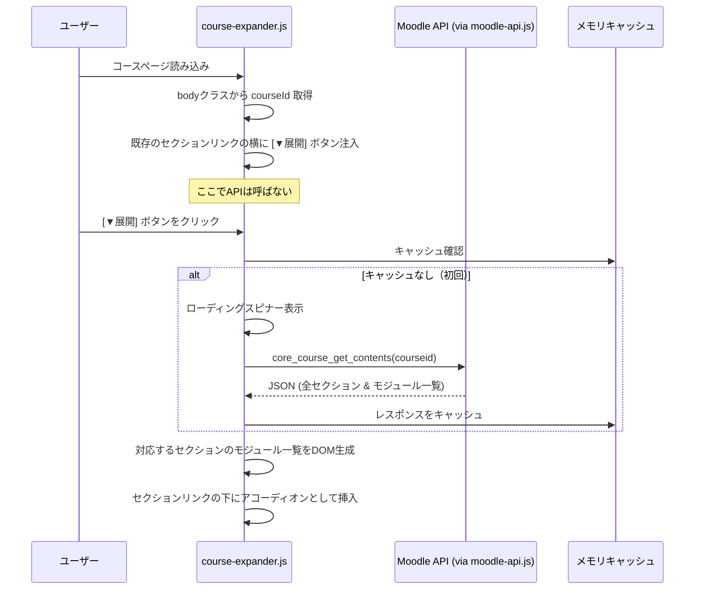
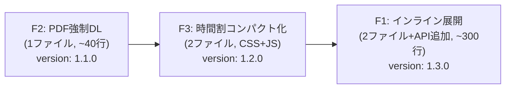

# Phase 2: Moodle UX改善 — 要件定義・詳細設計 v2

> **v2 変更点**: 設計レビューで指摘された Critical/Major 問題をすべて反映。
> Phase 1.5 リファクタリング（`moodle-api.js` 統合、メッセージパッシング方式）の完了を前提とする。

---

## 1. 概要

立命館大学 Moodle (`lms.ritsumei.ac.jp`) のUXを Chrome拡張機能から大幅に改善する。Phase 1（ダウンロードファイルの自動フォルダ分け）に続き、Phase 2ではMoodle APIとDOM操作を組み合わせた3つの機能を実装する。

### Phase 1.5 で解決済みの前提条件

| 項目 | 状態 |
|------|------|
| `moodle-api.js` の共通モジュール化 | ✅ 完了 — `callMoodleApi()`, `getSesskey()`, `cleanCourseName()`, `sanitizeForFilename()` が利用可能 |
| background.js ↔ content.js のメッセージパッシング | ✅ 完了 — `GET_COURSE_ID`, `RESOLVE_COURSE_NAME` が動作確認済み |
| コードの重複排除 | ✅ 完了 |

---

## 2. 機能一覧と優先度

| 機能ID | 機能名 | 概要 | 優先度 |
|--------|--------|------|--------|
| F2 | PDF強制ダウンロード化 | ブラウザでPDFが開かれる問題を解決し、直接DLさせる | ★★★ 最高 |
| F3 | 時間割のコンパクト表示 | ダッシュボードの時間割が大きすぎてスクロールが必要な問題を解決 | ★★☆ 高 |
| F1 | コースコンテンツのインライン展開 | Week→資料→PDFと深くクリックする必要をなくす | ★★★ 最高 |

> 実装順序は F2 → F3 → F1。工数の昇順で段階的にリリース可能。

---

## 3. F2: PDF強制ダウンロード化

### 3.1. 現状の問題

Moodleのファイルリソース (`mod/resource/view.php`) をクリックすると、デフォルトでブラウザの内蔵PDFビューアでファイルが **表示** される。ユーザーはローカルにコースごとに資料を保存・管理したいため、毎回手動で「ダウンロード」ボタンを押す手間が発生している。

#### 現在のリンク構造 (DOM調査結果)
リソースページ (`mod/resource/view.php`) 内に、以下のクラスを持つリンクが存在する:
```html
<div class="resourceworkaround">
  <a href="https://lms.ritsumei.ac.jp/pluginfile.php/{contextId}/mod_resource/content/{version}/{filename}">
    ファイル名
  </a>
</div>
```

### 3.2. 理想の状態

- **方法A（F1との連携）**: F1のインライン展開から直接ダウンロード（`?forcedownload=1` 付きURL）
- **方法B（リソースページでの自動DL）**: `mod/resource/view.php` に遷移してしまった場合、PDFリンクの `href` 属性を書き換えて `?forcedownload=1` を付与する

### 3.3. 技術設計

#### 方針: リンク書き換え方式（リダイレクトではなく）

> [!IMPORTANT]
> v1 の設計では `window.location.replace()` による自動リダイレクトを採用していたが、
> これは Phase 1 の `onDeterminingFilename` リスナーの referrer 解析と競合するリスクがある。
>
> v2 では**リンクの `href` 属性を書き換える方式**を採用する。
> ユーザーのクリック操作を維持し、背景のフォルダ分けロジックに干渉しない。

```javascript
// force-download.js — /mod/resource/view.php 専用
// run_at: "document_end" で実行（DOM構築直後、画像読み込み前）

(function() {
    // 対象ページの判定
    if (!location.pathname.startsWith('/mod/resource/view.php')) return;

    const resourceLink = document.querySelector('.resourceworkaround a');
    if (!resourceLink) return;

    const href = resourceLink.href;

    // pluginfile.php URLs のみ対象
    if (!href.includes('pluginfile.php')) return;

    // PDF ファイルの判定（拡張子 or Content-Disposition は事前に不明なため拡張子で判定）
    const isPdf = href.toLowerCase().endsWith('.pdf') ||
                  resourceLink.textContent.trim().toLowerCase().endsWith('.pdf');

    if (!isPdf) return;

    // リンクの href に forcedownload=1 を付与
    const url = new URL(href);
    url.searchParams.set('forcedownload', '1');
    resourceLink.href = url.toString();

    // ユーザーへのフィードバック: リンクテキストにダウンロードアイコンを追加
    resourceLink.insertAdjacentHTML('beforeend', ' 📥');
    resourceLink.title = 'クリックで直接ダウンロードします（Moodle Enhancer）';

    log('PDF強制ダウンロード: リンクを書き換えました', url.toString());
})();
```

#### Phase 1 との連携確認

| シナリオ | referrer | courseId 解決 | 結果 |
|---------|----------|--------------|------|
| リソースページでリンククリック | `mod/resource/view.php?id=XXX` | タブの body クラス経由 | ✅ 正常動作 |
| F1 展開リストからダウンロード | `course/view.php?id=YYY` | referrer URL 直接抽出 | ✅ 正常動作 |

#### 実装ファイル
- `src/content/force-download.js` [NEW] — リソースページでのリンク書き換え

---

## 4. F3: 時間割のコンパクト表示

### 4.1. 現状の問題

ダッシュボード (`/my/`) 下部の「My時間割表」は、各コマ（セル）のサイズが非常に大きく、1画面内に全コマが収まらない。スクロールしないと3限以降が見えない。

#### DOM構造（調査結果）
```
div.timetable-table ─── table.timetable
    └── tr
        ├── td.time        (時限のヘッダセル: "1", "2", ...)
        ├── td.empty       (空きコマ)
        └── td.highlight   (授業があるコマ)
```
- テーブルが `<table>` 要素で構成されており、各行 `<tr>` が1つのコマ（時限）に対応。
- `td.highlight` は科目名・教室名・アイコンを含むため、テキスト量に応じてセルが縦方向に膨張。
- 3限の行は最大 **580px** 以上にまで膨張する場合がある。

### 4.2. 理想の状態

時間割全体がスクロールなしで画面内に収まる。各コマのセルサイズを均等でコンパクトにし、科目名と教室名の最低限の情報が一覧できる。

### 4.3. 技術設計

#### CSSオーバーライド（レスポンシブ対応版）

> [!IMPORTANT]
> v1 では `60px`, `500px` 等のハードコード値を使用していたが、
> v2 では `vh` 単位と `calc()` を活用し、画面解像度に依存しない設計にする。

```css
/* ===========================================================
   時間割コンパクト化 — Moodle Enhancer
   対象: /my/* (ダッシュボード)
   セレクタスコープ: .timetable-table table.timetable に厳密限定
   =========================================================== */

/* テーブルレイアウトを固定化 */
.timetable-table table.timetable {
    table-layout: fixed !important;
    width: 100% !important;
}

/* 各セルの高さをビューポート基準で均等分配
   7コマ + ヘッダ1行 = 8行 → 各行 = (利用可能高さ) / 8
   時間割コンテナは画面の約70%を使う想定 */
.timetable-table table.timetable td,
.timetable-table table.timetable th {
    height: calc(70vh / 8) !important;
    max-height: calc(70vh / 8) !important;
    padding: 2px 4px !important;
    overflow: hidden !important;
    text-overflow: ellipsis !important;
    vertical-align: top !important;
    box-sizing: border-box !important;
}

/* 授業セル: テキストを省略表示 */
.timetable-table table.timetable td.highlight {
    position: relative !important;
    cursor: pointer !important;
}

.timetable-table table.timetable td.highlight a {
    display: block !important;
    height: 100% !important;
    width: 100% !important;
    font-size: clamp(0.65rem, 1.2vw, 0.85rem) !important;
    line-height: 1.2 !important;
    text-decoration: none !important;
    overflow: hidden !important;
}

/* 時限ヘッダセル */
.timetable-table table.timetable td.time {
    width: 30px !important;
    text-align: center !important;
    font-weight: bold !important;
}

/* ホバー時: セル内容を浮き上がらせて全文表示 */
.timetable-table table.timetable td.highlight:hover {
    overflow: visible !important;
    z-index: 100 !important;
}

.timetable-table table.timetable td.highlight:hover::after {
    content: attr(data-tooltip);
    position: absolute !important;
    top: 0 !important;
    left: 0 !important;
    right: 0 !important;
    min-height: 100% !important;
    padding: 6px !important;
    background: var(--bs-body-bg, #fff) !important;
    border: 1px solid var(--bs-border-color, #dee2e6) !important;
    box-shadow: 0 4px 12px rgba(0, 0, 0, 0.15) !important;
    border-radius: 4px !important;
    z-index: 101 !important;
    font-size: 0.8rem !important;
    line-height: 1.4 !important;
    white-space: normal !important;
    pointer-events: none !important;
}
```

#### ツールチップのJS強化

CSSだけでは `::after` を使う `data-tooltip` 属性の設定ができないため、軽量なJSで補助する。

```javascript
// timetable-compact.js — /my/* 専用

(function() {
    if (!location.pathname.startsWith('/my/')) return;

    // 時間割テーブルの検出を待つ（遅延読み込みの場合に備え）
    function initTimetableCompact() {
        const cells = document.querySelectorAll(
            '.timetable-table table.timetable td.highlight'
        );

        if (cells.length === 0) {
            log('時間割セルが見つかりませんでした。');
            return;
        }

        cells.forEach(cell => {
            // セルのテキスト内容を data-tooltip 属性にコピー
            const text = cell.textContent.trim();
            if (text) {
                cell.setAttribute('data-tooltip', text);
            }
        });

        log(`時間割コンパクト化: ${cells.length} セルにツールチップを設定`);
    }

    // DOM の準備完了後に実行
    if (document.readyState === 'loading') {
        document.addEventListener('DOMContentLoaded', initTimetableCompact);
    } else {
        initTimetableCompact();
    }
})();
```

#### hover ではなく click によるトグル表示（タッチデバイス対応）

> v1 レビューで指摘されたタッチデバイス問題への対策として、
> `:hover` に加え `click` でもツールチップがトグルされるようにする。
> ただし、セル内の `<a>` リンク（授業ページへの遷移）をブロックしないよう、
> クリック対象はリンク以外の領域のみとする。

```javascript
// timetable-compact.js 内に追加（上記の initTimetableCompact 内）

cells.forEach(cell => {
    // タッチデバイス対応: クリックでツールチップトグル
    cell.addEventListener('click', (e) => {
        // <a> タグ自体のクリックはリンク遷移を許可
        if (e.target.tagName === 'A' || e.target.closest('a')) return;

        cell.classList.toggle('me-tooltip-active');
    });
});
```

```css
/* クリックでのツールチップ表示（タッチデバイス対応） */
.timetable-table table.timetable td.highlight.me-tooltip-active::after {
    /* hover と同じスタイルを適用 */
    content: attr(data-tooltip);
    position: absolute !important;
    /* ... hover 時と同一のスタイル ... */
}
```

#### 実装ファイル
- `src/content/timetable-compact.css` [NEW] — 時間割コンパクト化CSS
- `src/content/timetable-compact.js` [NEW] — ツールチップ設定 & タッチ対応

---

## 5. F1: コースコンテンツのインライン展開

### 5.1. 現状の問題

コースページ (`/course/view.php?id=XXXXX`) では、各週（Week1, Week2...）がセクションとして表示されるが、各セクションをクリックすると **別のページ** (`/course/section.php?id=YYYYY`) に遷移する。さらにその中の資料をクリックするとまた別のページ (`/mod/resource/view.php?id=ZZZZZ`) に遷移し、そこでようやくPDFへのリンクが表示される。

```
ダッシュボード → コースページ → section.php（Week1）→ resource/view.php → PDF
            4クリック必要
```

### 5.2. 理想の状態

コースページ上で各Weekのボタンを押すと、**ページ遷移なしに** そのWeekに含まれるすべてのアクティビティ（資料、課題、小テストなど）が同一ページ内にアコーディオン形式で展開される。

```
コースページ上で [▼ Week1] を展開 → 資料リスト即表示 → ワンクリックDL
            1クリック + 1クリックDL = 2クリックで完了
```

### 5.3. 技術設計

#### 使用するAPI
- **`core_course_get_contents`**
    - 引数: `courseid` (コースID)
    - 戻り値: セクション配列。各セクションには `modules[]` があり、各モジュールに `name`, `modname`, `modicon`, `url`, `contents[]` (ファイルリソースの場合にDL用URL含む) が含まれる。

#### Lazy Loading + キャッシュ方式

> [!IMPORTANT]
> v1 はページ読み込み時に全セクション分のAPIデータを即座に取得していたが、
> v2 では **展開ボタンクリック時に初めてAPI呼び出し** を行う Lazy Loading 方式を採用する。
>
> `core_course_get_contents` はコース単位での取得しかできないため、
> 初回クリック時に全セクション分をフェッチし、以降は **メモリキャッシュ** を使う。



#### fileurl の変換処理

> [!CAUTION]
> `core_course_get_contents` が返す `fileurl` は `/webservice/pluginfile.php/` パスで、
> トークン認証専用。Cookie認証の Content Script からはアクセスできない(403)。
> **必ず `/pluginfile.php/` に置換し、`token=` パラメータを除去する。**

```javascript
/**
 * Moodle API の fileurl を Cookie 認証で使えるURLに変換する。
 * /webservice/pluginfile.php/ → /pluginfile.php/ に置換し、token パラメータを除去。
 *
 * @param {string} fileurl - API から取得した fileurl
 * @returns {string} 変換後の URL
 */
function convertFileUrl(fileurl) {
    if (!fileurl) return '';

    let url = fileurl;

    // /webservice/pluginfile.php/ → /pluginfile.php/ に変換
    url = url.replace('/webservice/pluginfile.php/', '/pluginfile.php/');

    // token パラメータを除去
    try {
        const urlObj = new URL(url);
        urlObj.searchParams.delete('token');
        url = urlObj.toString();
    } catch (e) {
        // URL パース失敗時はそのまま返す
    }

    return url;
}
```

#### DOM操作の対象セレクタ（フォールバック付き）

```javascript
// セクション要素の検出 — 複数セレクタでフォールバック
const SECTION_SELECTORS = [
    '.course-content .section',           // Moodle 4.x Boost テーマ
    '#region-main .section',              // 一般的なフォールバック
    '[data-region="course-content"] .section'  // Moodle 4.2+ の data属性
];

function findSections() {
    for (const selector of SECTION_SELECTORS) {
        const sections = document.querySelectorAll(selector);
        if (sections.length > 0) return sections;
    }
    warn('セクション要素が見つかりません。テーマの変更が原因の可能性があります。');
    return [];
}
```

#### 展開時に表示する情報と階層構造

フラットに並べるだけでは「授業資料」と「補足資料」のフォルダの違いが分からなくなるため、階層構造を維持してUI展開する。

| 表示項目 (リストの1行) | ソース |
|----------|--------|
| アイコン | `module.modicon` |
| 資料名・フォルダ名 | `module.name` |
| 種別タグ | `module.modname` ("resource"→📄, "assign"→📝, "folder"→📁 等) |
| ダウンロードリンク (PDFの場合) | `convertFileUrl(module.contents[0].fileurl)` + `?forcedownload=1` |

#### エラーハンドリングとローディングUI

```javascript
// ローディング状態の管理
function showSectionLoading(sectionElement) {
    const loader = document.createElement('div');
    loader.className = 'me-section-loader';
    loader.innerHTML = `
        <div class="me-spinner"></div>
        <span>読み込み中...</span>
    `;
    sectionElement.appendChild(loader);
    return loader;
}

function showSectionError(sectionElement, message) {
    const error = document.createElement('div');
    error.className = 'me-section-error';
    error.innerHTML = `
        <span>⚠️ ${message}</span>
        <button class="me-retry-btn">再試行</button>
    `;
    sectionElement.appendChild(error);
    return error;
}
```

#### Graceful Degradation

- セクションの DOM セレクタが見つからない → 展開ボタンを注入しない（既存UIに影響なし）
- API 呼び出し失敗 → ローディングスピナーをエラーメッセージに置換 + 再試行ボタン表示
- sesskey 期限切れ → 「ページを再読み込みしてください」メッセージ
- フォールバック: 既存のセクションリンク（別ページ遷移）は常に残す

#### 実装ファイル
- `src/content/course-expander.js` [NEW] — メインのUI構成ロジック
- `src/content/course-expander.css` [NEW] — アコーディオン・ローディング・エラーUI用CSS
- `src/lib/moodle-api.js` [MODIFY] — `convertFileUrl()` を追加

---

## 6. ファイル構成まとめ（Phase 2 完成後）

```
src/
├── background/
│   └── background.js             (既存: DLフォルダ分け)
├── content/
│   ├── content.js                (既存: コース名保存 & メッセージ応答)
│   ├── course-expander.js        [NEW] F1: インライン展開UI
│   ├── course-expander.css       [NEW] F1: アコーディオン・ローディングUI
│   ├── force-download.js         [NEW] F2: PDFリンク書き換え
│   ├── timetable-compact.js      [NEW] F3: ツールチップ設定 & タッチ対応
│   └── timetable-compact.css     [NEW] F3: 時間割コンパクトCSS
├── lib/
│   └── moodle-api.js             (既存+追加: convertFileUrl)
└── assets/
    ├── icon48.png
    └── icon128.png
```

---

## 7. manifest.json の更新（ページ別 Content Script 分離）

> [!IMPORTANT]
> 各機能の Content Script を **対象ページにのみ** 注入する設計に変更。
> v1 では全スクリプトを全ページで実行していたが、v2 では不要なスクリプトロードとDOM探索を排除する。

```jsonc
{
    "manifest_version": 3,
    "name": "Moodle Enhancer for Ritsumeikan",
    "version": "1.1.0",
    "description": "立命館大学Moodleのダウンロード整理・コース展開・時間割コンパクト化",
    "permissions": ["storage", "downloads"],
    "host_permissions": ["https://lms.ritsumei.ac.jp/*"],
    "background": {
        "service_worker": "src/background/background.js"
    },
    "content_scripts": [
        {
            // 基盤: 全 Moodle ページで共通ライブラリとコース名キャッシュを実行
            "matches": [
                "https://lms.ritsumei.ac.jp/course/view.php*",
                "https://lms.ritsumei.ac.jp/course/section.php*",
                "https://lms.ritsumei.ac.jp/mod/*",
                "https://lms.ritsumei.ac.jp/my/*"
            ],
            "js": [
                "src/lib/moodle-api.js",
                "src/content/content.js"
            ],
            "run_at": "document_idle"
        },
        {
            // F1: コースページ専用 — インライン展開UI
            "matches": ["https://lms.ritsumei.ac.jp/course/view.php*"],
            "js": ["src/content/course-expander.js"],
            "css": ["src/content/course-expander.css"],
            "run_at": "document_idle"
        },
        {
            // F2: リソースページ専用 — PDF強制ダウンロード
            "matches": ["https://lms.ritsumei.ac.jp/mod/resource/view.php*"],
            "js": ["src/content/force-download.js"],
            "run_at": "document_end"
        },
        {
            // F3: ダッシュボード専用 — 時間割コンパクト化
            "matches": ["https://lms.ritsumei.ac.jp/my/*"],
            "js": ["src/content/timetable-compact.js"],
            "css": ["src/content/timetable-compact.css"],
            "run_at": "document_idle"
        }
    ],
    "icons": {
        "48": "src/assets/icon48.png",
        "128": "src/assets/icon128.png"
    }
}
```

### 設計判断の根拠

| 設定 | 値 | 理由 |
|------|-----|------|
| F2 の `run_at` | `document_end` | DOM構築直後に実行。`document_start` では `.resourceworkaround` がまだ存在しない |
| F1, F3 の `run_at` | `document_idle` | 既にページが表示された後にUIを追加しても問題ないため |
| `scripting` パーミッション | **削除** | Phase 1.5 でメッセージパッシングに移行したため `chrome.scripting.executeScript` は不要 |
| 基盤の `matches` に `/my/*` 追加 | — | F3 の `timetable-compact.js` が `log()` 等の `moodle-api.js` の関数を使うため |
| バージョン | `1.1.0` | SemVer 慣例: 機能追加は minor version |

---

## 8. キャッシュ戦略

### 8.1. `courseNames` キャッシュ (Phase 1 から継続)

- **保存先**: `chrome.storage.local`
- **キー**: コースID → コース名
- **有効期限**: 7日間。取得時にタイムスタンプをチェックし、期限切れなら再取得。

```javascript
// moodle-api.js に追加する キャッシュ情報の構造
// chrome.storage.local: {
//   courseNames: { "12345": "企業倫理論(BA)", ... },
//   courseNameTimestamps: { "12345": 1713000000000, ... }
// }

const CACHE_EXPIRY_MS = 7 * 24 * 60 * 60 * 1000; // 7日間

async function isCacheValid(courseId) {
    const result = await chrome.storage.local.get(['courseNameTimestamps']);
    const timestamps = result.courseNameTimestamps || {};
    const timestamp = timestamps[courseId];
    if (!timestamp) return false;
    return (Date.now() - timestamp) < CACHE_EXPIRY_MS;
}
```

### 8.2. `courseContents` キャッシュ (F1 用)

- **保存先**: メモリのみ（`WeakMap` or ページ内変数）。ページリロードで消去。
- **理由**: コースコンテンツは頻繁に更新されうるため、長期キャッシュは不適切。タブ内でのみキャッシュ。

---

## 9. 実装順序



各機能を**個別に実装・テスト・コミット**し、段階的にリリースする。

---

## 10. テスト計画

### 10.1. 正常系テスト

| 機能 | テスト方法 | 確認ポイント |
|------|-----------|-------------|
| F2 | `mod/resource/view.php` に遷移 | PDFリンクに `?forcedownload=1` が付与されているか、📥アイコンが表示されるか |
| F2 | PDFリンクをクリック | ダウンロードが開始され、`Moodle/[授業名]/` に保存されるか (Phase 1 連携) |
| F3 | ダッシュボード `/my/` を開く | 全コマがスクロール不要で表示されるか |
| F3 | 時間割セルにマウスオーバー | ツールチップで全文が表示されるか |
| F1 | コースページの展開ボタンクリック | ローディング → モジュール一覧表示 |
| F1 | 展開リスト内のPDFリンクをクリック | ダウンロードが開始され、フォルダ分けが正しいか |

### 10.2. 異常系テスト

| テスト | 期待される挙動 |
|-------|--------------|
| ネットワーク切断時にF1展開ボタンクリック | ローディング → エラーメッセージ + 再試行ボタン |
| ログアウト状態でF1展開ボタンクリック | sesskey 取得失敗 → 「ページを再読み込みしてください」メッセージ |
| PDF以外のファイル (動画, Word) のリソースページ | F2 のリンク書き換えが**発動しない**こと |
| 空のコース (モジュールなし) で展開 | 「コンテンツがありません」メッセージ |

### 10.3. 回帰テスト (Phase 1)

| テスト | 確認ポイント |
|-------|-------------|
| コースページからのPDFダウンロード | `Moodle/[授業名]/[ファイル名]` に保存される |
| `mod/resource/view.php` からのPDFダウンロード | フォルダ分けが正しく動作する |
| Moodle以外のサイトからのダウンロード | フォルダ分けが**発動しない**こと |
| 新規コース (キャッシュなし) のPDFダウンロード | API呼び出し → コース名取得 → 正しいフォルダに保存 |

### 10.4. パフォーマンステスト

| テスト | 確認ポイント |
|-------|-------------|
| 10個のコースタブを同時に開く | API呼び出しが10回発生しない (F1 は Lazy なので0回) |
| 20セクションあるコースでF1展開 | ローディングが3秒以内に完了する |

---

## 11. 既知のリスクと対策

| リスク | 対策 | 重要度 |
|--------|------|--------|
| `fileurl` が `/webservice/pluginfile.php/` パスで返る | `convertFileUrl()` で `/pluginfile.php/` に変換 + `token` パラメータ除去 | 🔴 対策済み |
| F2のリンク書き換えがPDF以外にも発動 | 拡張子 `.pdf` チェックで制御。将来的に options ページで全ファイルDL選択可能に | 🟠 対策済み |
| F3のCSSがMoodleの他のUIを破壊 | セレクタスコープを `.timetable-table table.timetable` に厳密限定 | 🟠 対策済み |
| F1でAPI取得失敗 | ローディング → エラー表示 + 再試行ボタン。既存リンクは残す | 🟠 対策済み |
| F3のホバーがタッチデバイスで効かない | click トグルを JS で実装 | 🟡 対策済み |
| DOM セレクタがテーマ更新で変更される | 複数フォールバックセレクタ + graceful degradation | 🟡 対策済み |
| `courseNames` キャッシュが永久に残る | 7日間の TTL を導入 | 🔵 対策済み |
